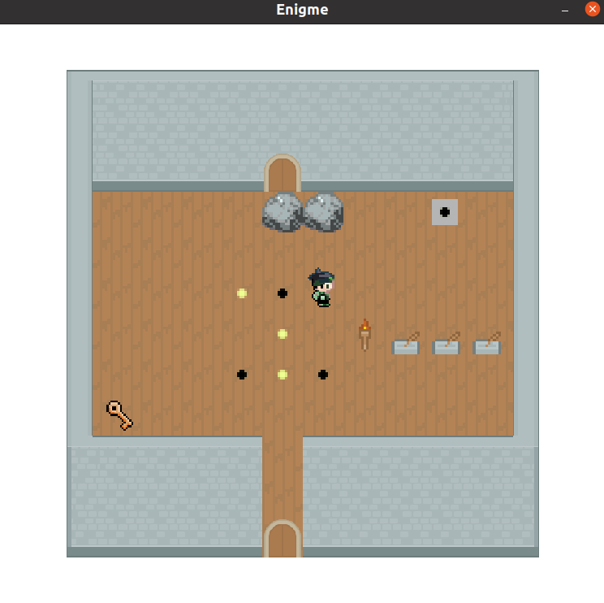

-----How to launch-----

In the Play class, you can replace "new Enigme()" at line 33 by "new Demo1()" or "new Demo2()" to launch the other parts of the project.

-----Controls-----

Left key - move your character left

Up key - move your character up

Right key - move your character right

Down key - move your character down

R - toggle running mode, which makes you move faster

P - toggle pause mode, which pauses the game

SPACE - scrolls through dialogue windows and closes them once they are done

L - interact with other actors in the game

-----Levels-----

In the Level Selector where your character first appears, 5 levels are available:
 
* Levels 1 - 3 are only to showcase the different functionalities and actors which were required to implement
.
* Level 4 is mainly to showcase the Foreground feature, which gives an impression of depth. It can be exited through a door at the very top of the level.
 
* Level 5 is the main level which integrates all the features, both those required and those from the extensions. Get to the end of the level to return to the level selector.
 
 

-----Walkthrough of Level 5-----
 
Upon entering the level, you can talk to the little character, who will provide backstory and will explain the controls. This is optional. On your left, the way is blocked by a boulder, so you will have to head right. The crates on the bottom do not do anything.

The first zone requires you to step on all of the pressure switches to make the rock blocking your path disappear. There are several ways to make all of the pressure switches be alight at the same time, and this zone shouldn't be too hard.

Once that is done, you can advance to the next zone, which is a maze. When you enter the maze, you are suddenly surrounded by darkness and a rock appears behind you, preventing you from leaving until you have solved the maze. When you enter the maze, go straight ahead until you hit a wall. Then go up and then right. What you are looking for is the campfire, which will dissipate the darkness when activated, and the teleport stone which is beside it, which will let you exit the maze.

Now, you are back near the beginning, and notice that the boulder which was preventing you from going left before is gone. You now have access to the ice level. Ice makes you slip, and you can only stop moving once you hit an obstacle. Thus, you have to make use of the rocks which are layed around on the ice in order to reach the exit, which is on the north side of the level. If you are stuck, here is the complete solution when you start from the stairs which take you to the ice level: left, down, left, down, right, down, left, up, right, up, left, up.

When you are done with the ice level, you arrive to a new level with 8 torches and an old man, who will give you a riddle. The answer is 42 and has to be given in binary through the torches : this corresponds to lighting (from the RIGHT) the 2nd, 4th and 6th torches. The rocks blocking your path will then disappear.

The last level is a speed level, which is only possible to beat if you activate running mode (press R). You have 3 seconds to step on all three of the pressure plates and pass through the passage that the rock, which has now disappeared, was blocking. If you are too slow, the rock will reappear and you will have to start again. Once you beat this level, you can activate a lever on the other side of the rock, which will make the rock disappear, allowing you to go back to the other side, if so you wish.
 

You now have access to the door which will take you to the castle's dungeon, which contains the royal cup. If you interact with it, you will get a congratulations message. To return to the level selector, simply walk out the door.
 

-----Credits-----

All textures come from kenney.nl, from which I have also added the texture for the ice.
